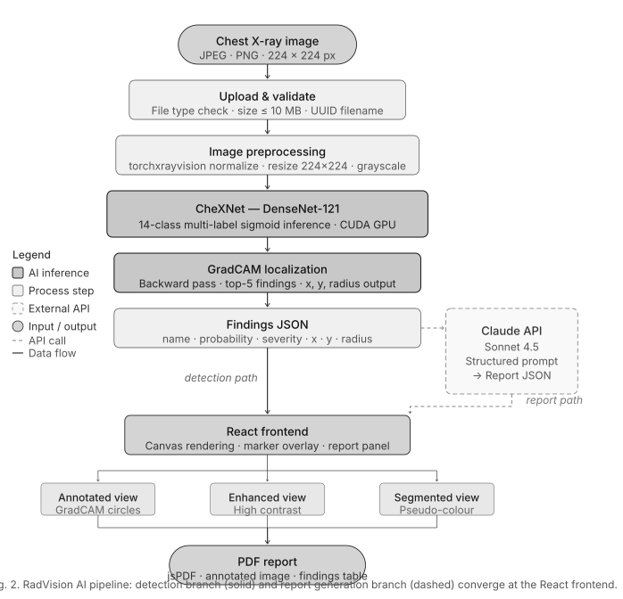

# RadVision AI: Chest X-Ray Analysis and Report Generation

RadVision AI is a research prototype that analyses frontal chest X-ray images and drafts a structured radiology report. It has two stages:

1. **Disease detection.** A DenseNet-121 model pretrained on chest X-rays (from [TorchXRayVision](https://github.com/mlmed/torchxrayvision), weights `densenet121-res224-all`) predicts probabilities for 14 thoracic findings: Atelectasis, Cardiomegaly, Effusion, Infiltration, Mass, Nodule, Pneumonia, Pneumothorax, Consolidation, Edema, Emphysema, Fibrosis, Pleural Thickening and Hernia. For the top five findings, Grad-CAM on the last dense block marks where in the image the finding is located.
2. **Report generation.** The findings go to Anthropic's Claude API, which returns a short structured report: findings, normal structures, impression, recommendations and urgency.

The system has a Flask backend (REST API, SQLite storage, landing page and admin dashboard), a React frontend for uploading images and viewing or exporting reports, and an evaluation script for the Indiana University Chest X-Ray (IU X-Ray) dataset.

> **Disclaimer:** This is research software. It is not a medical device and must not be used for clinical diagnosis.



---

## ⚠️ API key: the `.env` file is not included

The original `.env` file was **removed on purpose for security** because it held the author's private API key. **To run this project you need your own Anthropic API key.**

1. Get a key from <https://console.anthropic.com/>.
2. Copy the template and add your key:
   ```bash
   cd backend
   cp .env.example .env        # Windows: copy .env.example .env
   ```
3. Open `backend/.env` and set:
   ```
   ANTHROPIC_API_KEY=your_anthropic_api_key_here
   ```

Without a key, disease detection and localisation still work, but the report section will show a "Report generation error" message. Do not commit your `.env` file; it is already listed in `.gitignore`.

---

## Repository structure

```
xray-production/
├── backend/
│   ├── app.py                  # Flask server: /analyze, /feedback, /stats, /history, /, /admin
│   ├── xray_model.py           # DenseNet-121 loading, preprocessing, inference, Grad-CAM localisation
│   ├── report.py               # Report generation through the Anthropic Claude API
│   ├── database.py             # SQLite storage for analyses and clinician feedback (created automatically)
│   ├── evaluation_pipeline.py  # Evaluation on the IU X-Ray dataset (AUC, sensitivity, specificity, BLEU, ROUGE-L)
│   ├── test_model.py           # Quick check that the model loads
│   ├── website.html            # Landing page served at http://localhost:5000/
│   ├── admin.html              # Admin and feedback dashboard at http://localhost:5000/admin
│   ├── requirements.txt
│   ├── .env.example            # Template for your own .env (API key)
│   ├── uploads/  logs/  models/
├── frontend/                   # React app (Create React App), analyser at http://localhost:3000/analyzer
│   ├── src/App.js, src/index.js, src/services/api.js, src/styles/main.css
│   └── package.json
├── evaluation_results/                 # Evaluation outputs (200 IU X-Ray frontal images)
├── evaluation_results_without_radcam/  # Evaluation outputs from the variant without the localisation step
├── figures/                            # Paper figures (model architecture, pipeline flowchart)
└── LICENSE
```

---

## Requirements

- Python 3.10 or newer (developed on 3.13)
- Node.js 18 or newer and npm (only for the React frontend)
- An Anthropic API key (see above)
- A GPU is optional; the model runs on CPU.

The pretrained model weights (about 30 MB) are downloaded automatically by `torchxrayvision` on first run, so no weights are stored in this repository.

---

## How to run

### 1. Backend (Flask API)

```bash
git clone https://github.com/Gauravkrdas-spec/xray-production.git
cd xray-production/backend

python -m venv venv
# Windows: venv\Scripts\activate
# macOS/Linux: source venv/bin/activate

pip install -r requirements.txt

cp .env.example .env            # then add your ANTHROPIC_API_KEY
python test_model.py            # optional: checks that the model loads
python app.py
```

The server starts at **http://localhost:5000**.

| Endpoint | Method | Description |
|---|---|---|
| `/` | GET | Landing page |
| `/admin` | GET | Admin dashboard (statistics and clinician feedback) |
| `/analyze` | POST | Multipart form with `image` (JPG or PNG, up to 10 MB) and optional `patient_name`, `patient_age`, `patient_gender`, `referred_by`. Returns findings, locations and the report as JSON. |
| `/feedback` | POST | JSON clinician feedback about an analysis |
| `/stats` | GET | Summary statistics |
| `/history` | GET | Recent analyses and feedback |

Quick test from the command line:

```bash
curl -F "image=@path/to/chest_xray.png" http://localhost:5000/analyze
```

Uploaded images are deleted as soon as they have been analysed.

### 2. Frontend (React)

In a second terminal:

```bash
cd xray-production/frontend
npm install
npm start
```

Open **http://localhost:3000/analyzer**, upload a chest X-ray and view the annotated findings and the generated report. Reports can be exported as PDF. The frontend expects the backend at `http://localhost:5000`.

### 3. Reproducing the evaluation

`evaluation_pipeline.py` evaluates the system on the public **Indiana University Chest X-Ray** dataset. It is available on Kaggle as "Chest X-rays (Indiana University)" and contains `images_normalized/`, `indiana_projections.csv` and `indiana_reports.csv`.

1. Download the dataset.
2. Edit the paths in the **CONFIGURATION** block at the top of `backend/evaluation_pipeline.py` (`BACKEND_DIR`, `IMAGE_DIR`, `PROJ_CSV`, `REPORT_CSV`, `OUTPUT_DIR`). They currently point to the author's Windows folders.
3. Optionally change `MAX_IMAGES` (the default is 200) and `RUN_REPORT_EVAL`. Report evaluation calls the Claude API once per image, at roughly $0.01 per call.
4. Run:
   ```bash
   cd backend
   python evaluation_pipeline.py
   ```

The script maps IU X-Ray MeSH labels to the 14 findings, evaluates frontal views only, and writes ROC curves, confusion matrices, per-disease AUC, sensitivity and specificity, and BLEU and ROUGE-L report similarity, all as PNG and CSV files.

### Reported results (200 frontal IU X-Ray images)

From `evaluation_results/metrics_table_20260521_215006.csv`. AUC is only computed for findings that have positive cases in the sample.

| Finding | AUC | Sensitivity | Specificity |
|---|---|---|---|
| Atelectasis | 0.734 | 0.636 | 0.656 |
| Cardiomegaly | 0.686 | 0.571 | 0.704 |
| Effusion | 0.860 | 0.833 | 0.500 |
| Infiltration | 0.676 | 0.600 | 0.744 |
| Mass | 0.551 | 0.083 | 0.915 |
| Nodule | 0.618 | 0.667 | 0.599 |
| Emphysema | 0.310 | 0.000 | 0.721 |
| Hernia | 0.982 | 1.000 | 0.939 |
| **Mean** | **0.677** | **0.549** | **0.722** |

---

## Configuration (`backend/.env`)

| Variable | Required | Default | Purpose |
|---|---|---|---|
| `ANTHROPIC_API_KEY` | Yes | none | Your own Anthropic API key, used for report generation |
| `FLASK_PORT` | No | 5000 | Backend port |
| `UPLOAD_FOLDER` | No | `uploads` | Temporary storage for uploaded images |
| `LOG_FOLDER` | No | `logs` | Log file location |
| `MAX_IMAGE_SIZE_MB` | No | 10 | Upload size limit |

Report generation uses the model `claude-sonnet-4-5` (set in `backend/report.py`). If that model is no longer available, change it to a current model name.

---

## Data availability

The chest X-ray images used for evaluation come from the publicly available Indiana University Chest X-Ray collection (Demner-Fushman et al., 2016). They are not redistributed in this repository. Pretrained DenseNet-121 weights come from TorchXRayVision (Cohen et al., 2022). The evaluation outputs reported in the paper are included in `evaluation_results/`.

## License

MIT. See [LICENSE](LICENSE).
